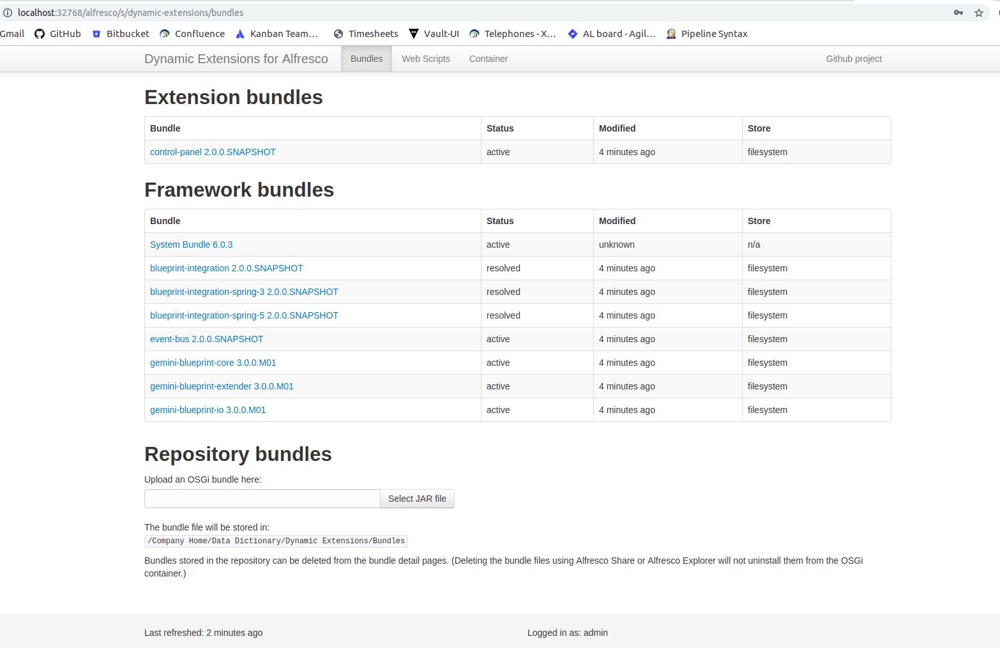

# Contributing

## Building the project
This project uses [Gradle](https://gradle.org/) as a build tool. It is a good idea to have a look at the Gradle basics before
diving into the project.

After checking out the project, the artifacts can be assembled using the `assemble` task.

* `./gradlew assemble`

Unit tests can be run using the `test` task.

* `./gradlew test`

If you have `docker` and `docker-compose` installed, it is possible to startup an Alfresco with Dynamic Extensions
installed using the integration testing suite. E.g. to start an Alfresco 6.1, including Dynamic Extensions, 
use the following command:

* `./gradlew :integration-tests:alfresco-61:composeUp`

> For Alfresco Enterprise, Xenit interal docker images are used. If you have access to the Xenit docker 
> infrastructure, it is possible to startup an Alfresco EE by using the Gradle `-Penterprise parameter`.  
> E.g. `./gradlew :integration-tests:alfresco-enterprise-61:composeUp -Penterprise`

Once started, e.g. the `docker ps` command can be used to see on which port Alfresco is available. To stop the Alfresco,
use the `composeDown` task can be used:

* `./gradlew :integration-tests:alfresco-61:composeDown`

## Usage
Once started up Alfresco with Dynamic Extensions, the dashboard is available on 
`${host}:${port}/alfresco/s/dynamic-extensions/`, where `${host}` can be `localhost` or your docker IP.

Via this dashboard it is possible to inspect and upload custom Dynamic Extensions Bundles. 